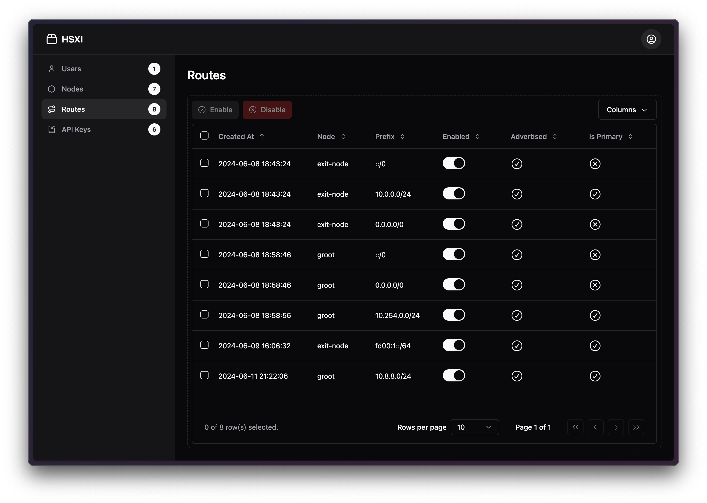

# HSXI

HSXI, A next generation interface for headscale - powered by shadcn



## Getting started

### Prerequisites

- [Docker] (https://www.docker.com/get-started)
- [Docker Compose] (https://docs.docker.com/compose/install)

### Customize headscale configurations

To customize the headscale configurations, you can edit headscale config yaml files in the `headscale/config` directory

See the [official headscale example config file](https://github.com/juanfont/headscale/blob/main/config-example.yaml) for more information on how to customize headscale

### Running the project

1. Clone the repository
2. Run the following command in the project root directory:

```bash
docker compose up -d
```

3. Access the project at `http://localhost:3000`

### Stop the project

To stop the project, run the following command in the project root directory:

```bash
docker compose down
```

## Credits

- [Headscale](https://github.com/juanfont/headscale)
- [Nuxt](https://github.com/nuxt/nuxt)
- [shadcn-vue](https://github.com/radix-vue/shadcn-vue)
